# 🛒 Retail Intelligence Platform

### End-to-End E-Commerce Analytics using Python, SQL, Pandas, Streamlit, Forecasting, Customer Segmentation, Market Basket Analysis, and Power BI

Retail Intelligence Platform is an end-to-end e-commerce analytics project built on the **Olist Brazilian E-Commerce Public Dataset**. It transforms raw marketplace data into a business-ready analytics solution covering customer behavior, retention, forecasting, seller performance, product purchase patterns, executive reporting, and interactive dashboard exploration.

---

# 🚀 Project Highlights

- End-to-end analytics project using a real multi-table retail dataset
- Data cleaning, EDA, feature engineering, and business KPI development
- Customer segmentation using **RFM**
- **Cohort / retention analysis**
- **Sales forecasting**
- **Market basket analysis**
- **Seller / marketplace analytics**
- **Power BI executive dashboard**
- **Streamlit analytics application**

---

# 📊 Power BI Dashboard Preview

The Power BI layer provides executive reporting across sales, customers, products, sellers, and delivery / review quality.

## Executive Overview
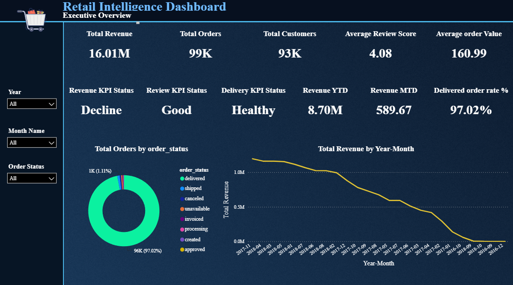

## Sales Performance
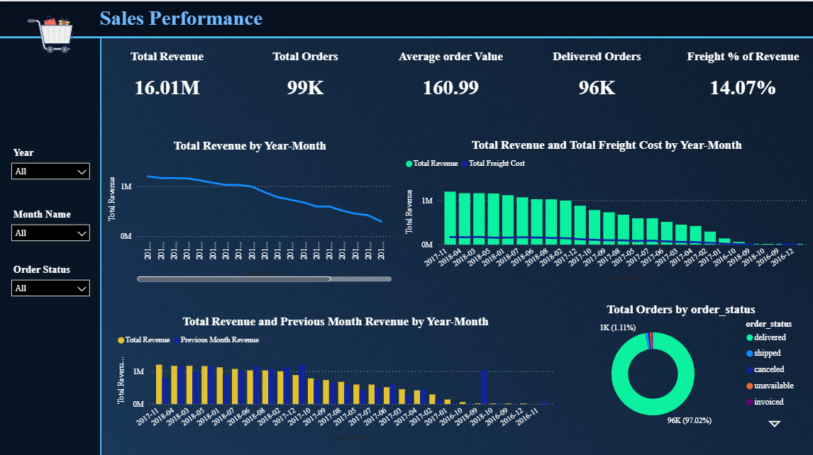

## Customer Analysis
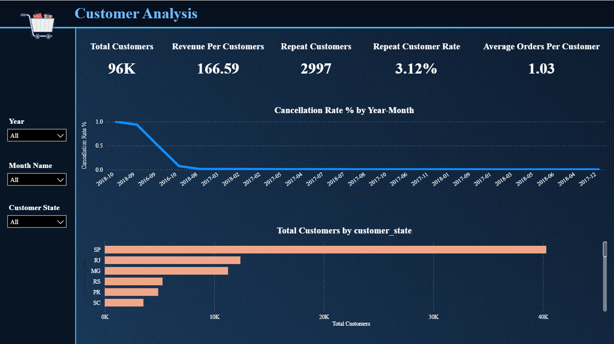

## Product and Category Analysis
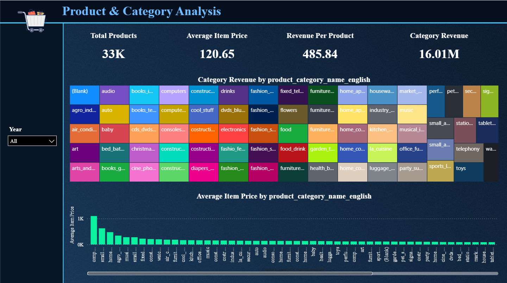

## Seller Analysis
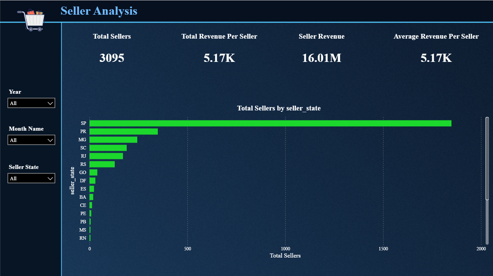

## Reviews and Delivery
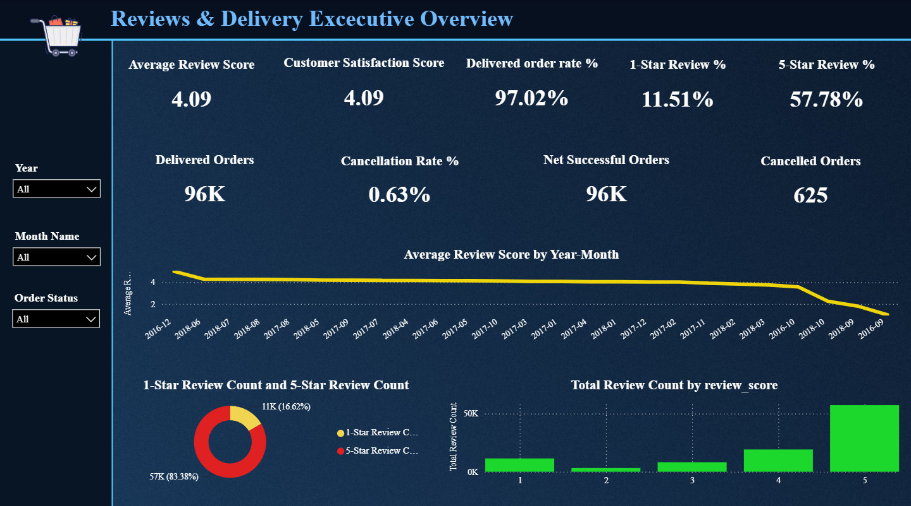

---

# 🖥️ Streamlit Application Preview

The Streamlit application acts as the interactive analytics layer of the project, allowing business users to explore KPIs, customer segments, retention trends, seller analytics, and market basket insights in an app format.

## Home
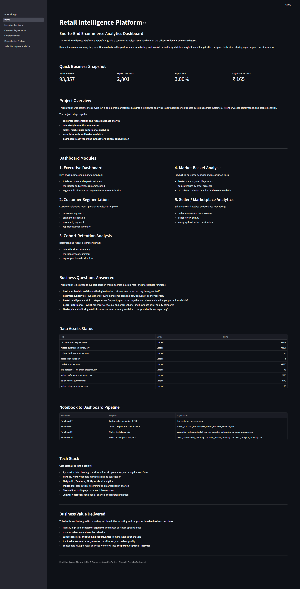

## Executive Dashboard
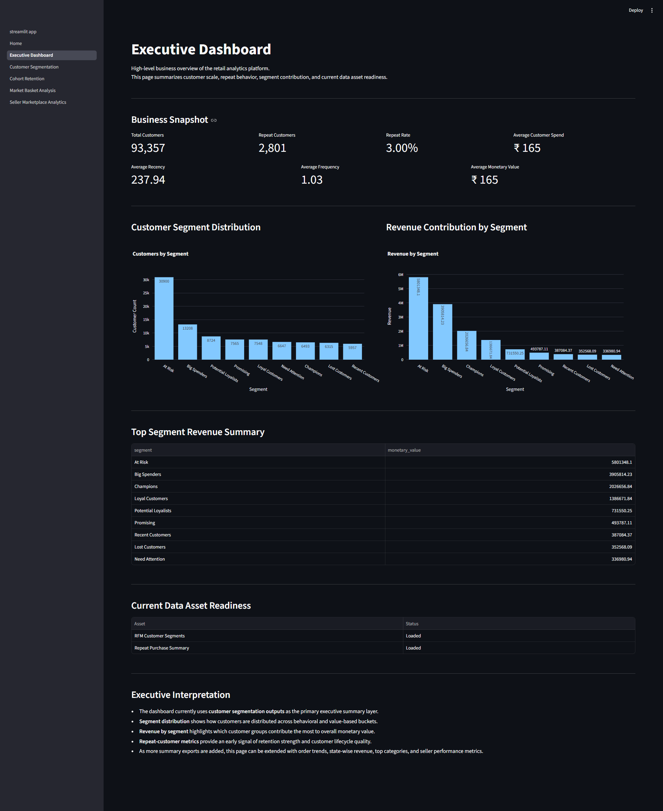

## Customer Segmentation
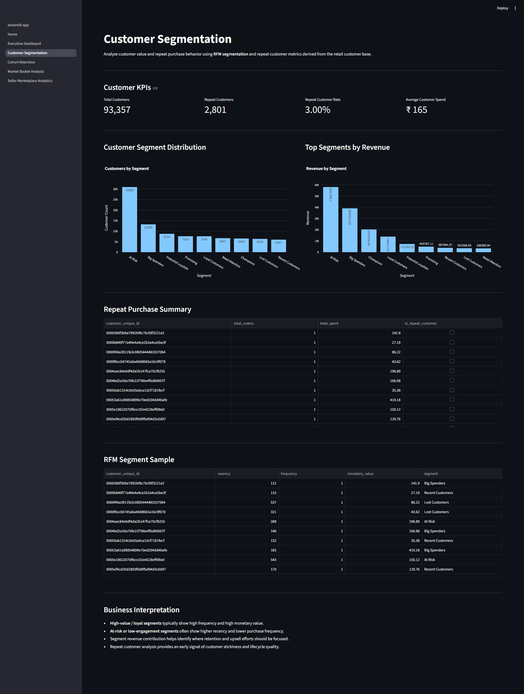

## Cohort Retention
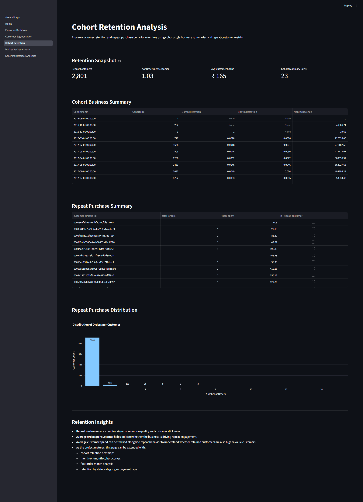

## Market Basket Analysis
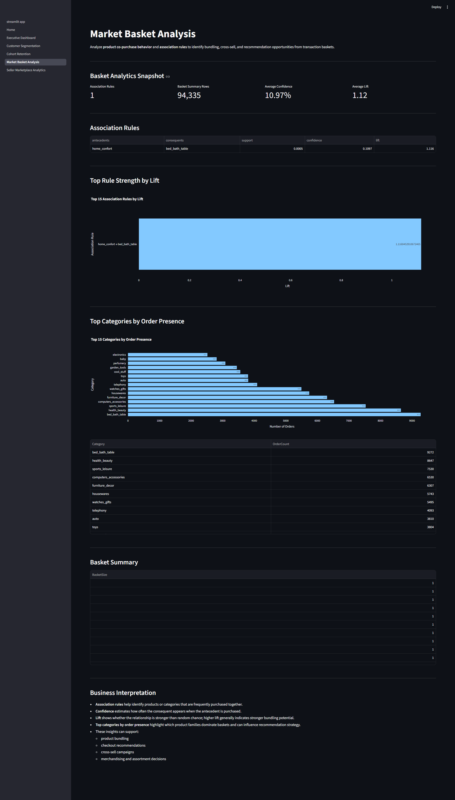

## Seller Marketplace Analytics
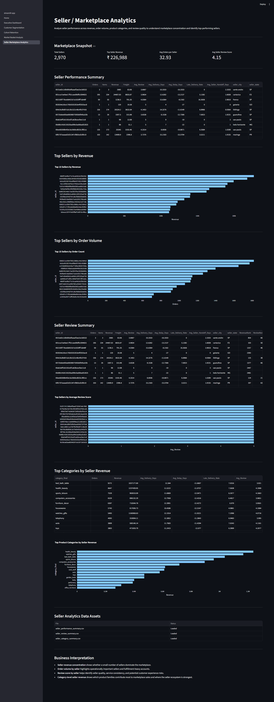

## Retail Intelligence Platform App View
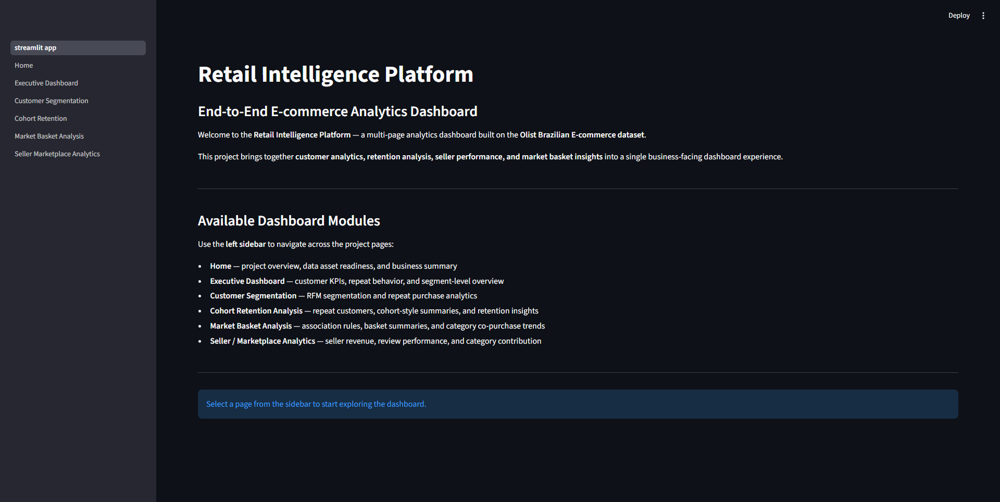

---

# 1. Business Problem

E-commerce businesses generate large volumes of data across customers, orders, products, sellers, reviews, and payments. However, raw transactional data is not directly useful for decision-makers unless it is transformed into business metrics, trend reporting, and analytical views.

This project was built to answer business questions such as:

- Who are the most valuable customers and how can they be segmented?
- How many customers make repeat purchases and what does retention behavior look like?
- What future sales trend can be expected from historical order data?
- Which product categories or items are frequently purchased together?
- Which sellers drive the most revenue and how does seller quality vary?
- Which KPIs should leadership monitor through executive dashboards?
- How can retail stakeholders explore insights interactively through a self-service analytics app?

---

# 2. Dataset

This project uses the **Olist Brazilian E-Commerce Public Dataset**, a publicly available multi-table marketplace dataset containing approximately **100,000 orders** placed between **2016 and 2018**.

### Core tables used
- `olist_orders_dataset`
- `olist_order_items_dataset`
- `olist_order_payments_dataset`
- `olist_order_reviews_dataset`
- `olist_customers_dataset`
- `olist_products_dataset`
- `olist_sellers_dataset`
- `product_category_name_translation`
- `olist_geolocation_dataset`

### Main business domains covered
- Customers
- Orders
- Products
- Sellers
- Payments
- Reviews
- Product categories
- Delivery / order lifecycle

---

# 3. Project Objectives

The main objectives of the Retail Intelligence Platform are to:

- build a production-style analytics project around a real retail dataset
- clean and prepare multi-table marketplace data for analysis
- create business KPIs across customers, sellers, and orders
- perform customer segmentation using RFM logic
- analyze repeat purchase and retention behavior
- forecast sales / order trends using time-series techniques
- identify product co-purchase patterns through market basket analysis
- evaluate seller performance and review quality
- build executive dashboards in **Power BI**
- deliver a business-facing analytics application using **Streamlit**

---

# 4. Project Architecture

```text
Raw Olist Data
      │
      ▼
Data Understanding / Cleaning / Feature Engineering
      │
      ▼
Analytical Notebooks
      │
      ├── Forecasting
      ├── Customer Segmentation
      ├── Cohort / Repeat Analysis
      ├── Market Basket Analysis
      ├── Seller Analytics
      └── Power BI Data Modeling
      │
      ▼
Exported Business Report Files / Analytical Outputs
      │
      ├── Power BI Dashboard Layer
      └── Streamlit Application Layer
      │
      ▼
Business Dashboards, KPIs, and Insights